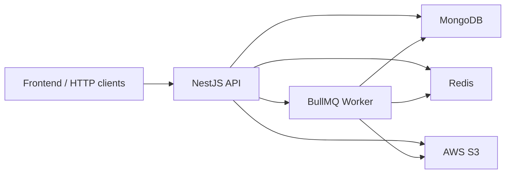
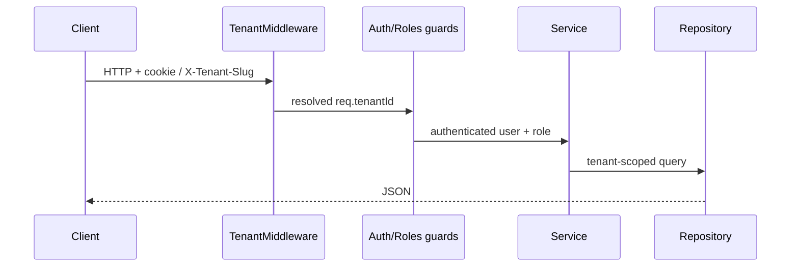

# api-maranguape

**[Português](README.md)** | **[English](README.en.md)**

Multi-tenant NestJS REST API for municipal HR and org-chart management — employees, departments, political reference chains, commissioned roles, dashboard, and white-label branding.

[](https://nestjs.com/)
[](https://www.typescriptlang.org/)
[](https://www.mongodb.com/)
[](https://redis.io/)
[](LICENSE)
[](https://nodejs.org/)

Web UI (demo): [interface-sistema-maranguape](https://interface-sistema-maranguape.vercel.app/)

---

## What it is

A production backend for municipalities that need **employee placement (lotação)**, **department hierarchy**, **reference chains**, reports, and an operational dashboard — with **per-tenant isolation** and visual customization (logo, colors, controlled CSS).

Originally built for the Municipality of Maranguape (CE, Brazil); today it runs as a multi-tenant white-label platform.

## Features

| Area | What you get |
|------|----------------|
| **Auth** | JWT in `httpOnly` cookie (`authToken`), session verify, logout |
| **Employees** | CRUD, lotação, S3 media, filters, CSV export, bulk delete (queue) |
| **Departments** | Org tree (roots → children), rename, reparent, delete |
| **References** | Hierarchical catalog, ancestors/descendants, employee chain, delete impact |
| **Commissioned roles** | CRUD + Excel template/import |
| **Search** | Autocomplete and full-text employee search |
| **Dashboard** | Summary, expiring contracts, payroll/quota view |
| **Tenants** | CRUD (superadmin), branding, asset upload, public CSS policy |
| **Audit** | Paginated action log (elevated roles) |
| **Ops** | Health, in-process metrics, embedded or standalone BullMQ worker |

## Stack

- **NestJS 11** + TypeScript
- **MongoDB** (Mongoose 8) — shared database scoped by `tenantId`
- **Redis** — versioned cache + **BullMQ** queues
- **AWS S3** — media and branding assets
- **Docker Compose** + Nginx (local)
- Helmet, credentialed CORS, rate limiting, compression

## Architecture



Simplified request flow:



Details: [docs/ARCHITECTURE.en.md](docs/ARCHITECTURE.en.md)

## Quick start

### Option A — Docker Compose

```bash
cp .env.example .env
# Set JWT_SECRET (and S3 if you need uploads)
docker compose up --build
```

API at `http://localhost:3000` (or Nginx at `http://localhost:8080`).

### Option B — Local

Prerequisites: Node.js 20+, reachable MongoDB and Redis.

```bash
cp .env.example .env
npm install
npm run dev
```

API listens on `http://localhost:3000` (`nest start --watch`).

## Environment variables

| Variable | Required | Description |
|----------|----------|-------------|
| `MONGO_CONNECTING_FUNCIONARIOS` | yes | MongoDB URI (data + users + tenants) |
| `JWT_SECRET` | yes | JWT signing secret |
| `JWT_EXPIRES_IN` | no | Default `24h` |
| `REDIS_URL` | recommended | Cache and queues (`redis://localhost:6379`) |
| `AWS_ACCESS_KEY_ID` / `AWS_SECRET_ACCESS_KEY` / `S3_BUCKET_NAME` | uploads | S3 credentials |
| `PORT` | no | Default `3000` |
| `BASE_DOMAIN` | production | Apex domain for subdomain CORS |
| `CORS_ORIGINS` | no | Extra origins (CSV) |
| `BULK_WORKER_EMBEDDED` | no | `true` (default) processes jobs in the API |
| `NEST_MIGRATED` | no | `all` — Nest owns every domain |

Full table and branding policy: [docs/RUNBOOK.en.md](docs/RUNBOOK.en.md). Template: [`.env.example`](.env.example).

## API map

| Prefix | Domain |
|--------|--------|
| `POST/GET /api/usuarios/*` | Login, logout, verify |
| `/api/usuarios/manage` | User management (owner/superadmin) |
| `/api/tenants` | Tenants and branding |
| `/api/funcionarios` | Employees, lotação, jobs, CSV |
| `/api/funcionarios/relatorio-funcionarios` | Typed report payload (`POST /dados`) |
| `/api/setores` | Organizational hierarchy |
| `/api/referencias` | Reference tree and chains |
| `/api/cargos-comissionados` | Roles + import |
| `/api/search` | Autocomplete and search |
| `/api/dashboard` | KPIs |
| `/api/audit` | Audit log |
| `/`, `/health`, `/metrics` | Health and metrics |

Inventory and `curl` examples: [docs/API.en.md](docs/API.en.md).

## Multi-tenant and roles

**Tenant resolution (order):**

1. JWT `tenantId` from cookie `authToken`, if authenticated
2. `X-Tenant-Slug` header
3. Subdomain from `Origin` / `Host` / `X-Forwarded-Host` vs `BASE_DOMAIN` (or `*.localhost` in dev)
4. Reserved hosts (`master`, `www`, `api`, …) → platform mode (no municipal tenant)

**Roles:**

| Role | Scope |
|------|--------|
| `superadmin` | Platform; may use `X-Act-As-Tenant` / `?actAs=` |
| `owner` | Full tenant control + user management |
| `admin` | Elevated ops (branding, references, dashboard, bulk…) |
| `user` | Staff ops (employees, lotação, CSV) |
| `readonly` | Present in enum; limited route usage |

Isolation: documents carry `tenantId`, Redis keys `tenant:{id}:…`, S3 objects `uploads/{tenantId}/…`. Non-superadmin **without** `tenantId` → 403.

## Scripts

```bash
npm run dev              # API in watch mode
npm run build && npm run prod
npm run worker:bulk      # worker when BULK_WORKER_EMBEDDED=false
npm test
npm run lint
npm run seed:superadmin
npm run migrate:tenant
npm run verify:tenant
npm run migrate:owners
npm run migrate:lotacao
npm run backfill:referencia-id
```

## Testing and quality

```bash
npm test      # Jest + mongodb-memory-server
npm run lint  # ESLint
```

CI: [`.github/workflows/ci-cd.yml`](.github/workflows/ci-cd.yml) (lint, build, test with Mongo + Redis).

## Documentation

| Doc | Contents |
|-----|----------|
| [docs/ARCHITECTURE.en.md](docs/ARCHITECTURE.en.md) | Modules, layers, worker, isolation |
| [docs/API.en.md](docs/API.en.md) | Routes, headers, curl examples |
| [docs/RUNBOOK.en.md](docs/RUNBOOK.en.md) | Ops, DNS/TLS, migrations, branding |

Portuguese versions: `README.md`, `docs/*.md` (without `.en`).

## Troubleshooting

| Issue | Check |
|-------|--------|
| Cookie not set cross-site | Production needs HTTPS + `sameSite=none` + `secure` |
| 403 without tenant | User needs `tenantId`, or send `X-Tenant-Slug` / subdomain |
| Cache/queues fail | `REDIS_URL` (or host/port) and Redis running |
| Upload fails | AWS/S3 env vars and bucket permissions |
| Local CORS | Empty `BASE_DOMAIN`; use `*.localhost` on the frontend |

## License

Released under the [GNU Affero General Public License v3.0](LICENSE).
