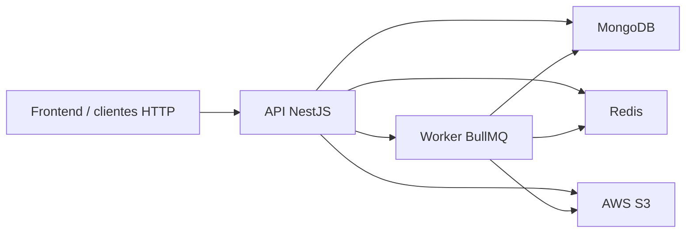
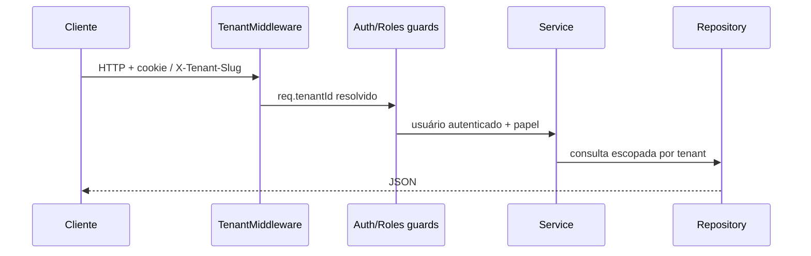

# api-maranguape

**[Português](README.md)** | **[English](README.en.md)**

API REST multi-tenant em NestJS para gestão de RH e organograma municipal — funcionários, setores, referências políticas, cargos comissionados, dashboard e branding white-label.

[](https://nestjs.com/)
[](https://www.typescriptlang.org/)
[](https://www.mongodb.com/)
[](https://redis.io/)
[](LICENSE)
[](https://nodejs.org/)

Interface web (demo): [interface-sistema-maranguape](https://interface-sistema-maranguape.vercel.app/)

---

## O que é

Backend de produção para prefeituras e órgãos que precisam de um sistema de **lotação de servidores**, **hierarquia de setores**, **cadeia de referências**, relatórios e painel operacional — com **isolamento por tenant** e personalização visual (logo, cores, CSS controlado).

Originalmente construído para a Prefeitura de Maranguape (CE); hoje funciona como plataforma white-label multi-município.

## Funcionalidades

| Área | O que entrega |
|------|----------------|
| **Auth** | Login JWT em cookie `httpOnly` (`authToken`), verificação de sessão, logout |
| **Funcionários** | CRUD, lotação, mídia no S3, filtros, export CSV, exclusão em massa (fila) |
| **Setores** | Árvore organizacional (raiz → filhos), rename, reparent, exclusão |
| **Referências** | Catálogo hierárquico, ancestrais/descendentes, cadeia do funcionário, impacto de exclusão |
| **Cargos comissionados** | CRUD + template/import Excel |
| **Busca** | Autocomplete e busca textual de funcionários |
| **Dashboard** | Resumo, contratos a vencer, visão de folha/cotas |
| **Tenants** | CRUD (superadmin), branding, upload de assets, política pública de CSS |
| **Auditoria** | Log paginado de ações (papéis elevados) |
| **Ops** | Health, métricas in-process, worker BullMQ embutido ou standalone |

## Stack

- **NestJS 11** + TypeScript
- **MongoDB** (Mongoose 8) — banco compartilhado com isolamento por `tenantId`
- **Redis** — cache versionado + filas **BullMQ**
- **AWS S3** — uploads de mídia e assets de branding
- **Docker Compose** + Nginx (ambiente local)
- Helmet, CORS com credentials, rate limit, compression

## Arquitetura


```mermaid
flowchart LR
  Client["Frontend / clientes HTTP"]
  API["API NestJS"]
  Worker["Worker BullMQ"]
  Mongo["MongoDB"]
  Redis["Redis"]
  S3["AWS S3"]

  Client --> API
  API --> Mongo
  API --> Redis
  API --> S3
  API --> Worker
  Worker --> Mongo
  Worker --> Redis
  Worker --> S3
```

Fluxo de request (simplificado):


```mermaid
sequenceDiagram
  participant C as Cliente
  participant T as TenantMiddleware
  participant G as Auth/Roles guards
  participant S as Service
  participant R as Repository

  C->>T: HTTP + cookie / X-Tenant-Slug
  T->>G: req.tenantId resolvido
  G->>S: usuário autenticado + papel
  S->>R: consulta escopada por tenant
  R-->>C: JSON
```

Detalhes: [docs/ARCHITECTURE.md](docs/ARCHITECTURE.md)

## Quick start

### Opção A — Docker Compose

```bash
cp .env.example .env
# Defina JWT_SECRET (e S3 se for testar uploads)
docker compose up --build
```

API em `http://localhost:3000` (ou via Nginx em `http://localhost:8080`).

### Opção B — Local

Pré-requisitos: Node.js 20+, MongoDB e Redis acessíveis.

```bash
cp .env.example .env
npm install
npm run dev
```

A API sobe em `http://localhost:3000` (`nest start --watch`).

## Variáveis de ambiente

| Variável | Obrigatória | Descrição |
|----------|-------------|-----------|
| `MONGO_CONNECTING_FUNCIONARIOS` | sim | URI MongoDB (dados + usuários + tenants) |
| `JWT_SECRET` | sim | Segredo de assinatura JWT |
| `JWT_EXPIRES_IN` | não | Padrão `24h` |
| `REDIS_URL` | recomendado | Cache e filas (`redis://localhost:6379`) |
| `AWS_ACCESS_KEY_ID` / `AWS_SECRET_ACCESS_KEY` / `S3_BUCKET_NAME` | uploads | Credenciais S3 |
| `PORT` | não | Padrão `3000` |
| `BASE_DOMAIN` | produção | Domínio apex para CORS por subdomínio |
| `CORS_ORIGINS` | não | Origins extras (CSV) |
| `BULK_WORKER_EMBEDDED` | não | `true` (padrão) processa jobs na API |
| `NEST_MIGRATED` | não | `all` — Nest domina todos os módulos |

Tabela completa e política de branding: [docs/RUNBOOK.md](docs/RUNBOOK.md). Modelo: [`.env.example`](.env.example).

## Mapa da API

| Prefixo | Domínio |
|---------|---------|
| `POST/GET /api/usuarios/*` | Login, logout, verify |
| `/api/usuarios/manage` | Gestão de usuários (owner/superadmin) |
| `/api/tenants` | Tenants e branding |
| `/api/funcionarios` | Funcionários, lotação, jobs, CSV |
| `/api/funcionarios/relatorio-funcionarios` | Payload tipado de relatório (`POST /dados`) |
| `/api/setores` | Hierarquia organizacional |
| `/api/referencias` | Árvore e cadeias de referência |
| `/api/cargos-comissionados` | Cargos + import |
| `/api/search` | Autocomplete e busca |
| `/api/dashboard` | KPIs |
| `/api/audit` | Auditoria |
| `/`, `/health`, `/metrics` | Saúde e métricas |

Inventário e exemplos `curl`: [docs/API.md](docs/API.md).

## Multi-tenant e papéis

**Resolução de tenant (ordem):**

1. `tenantId` do JWT (cookie `authToken`), se autenticado
2. Header `X-Tenant-Slug`
3. Subdomínio de `Origin` / `Host` / `X-Forwarded-Host` vs `BASE_DOMAIN` (ou `*.localhost` em dev)
4. Hosts reservados (`master`, `www`, `api`, …) → modo plataforma (sem tenant municipal)

**Papéis:**

| Papel | Escopo |
|-------|--------|
| `superadmin` | Plataforma; pode usar `X-Act-As-Tenant` / `?actAs=` |
| `owner` | Controle total do tenant + gestão de usuários |
| `admin` | Operações elevadas (branding, referências, dashboard, bulk…) |
| `user` | Operações de staff (funcionários, lotação, CSV) |
| `readonly` | Presente no enum; uso limitado nas rotas |

Isolamento: documentos com `tenantId`, chaves Redis `tenant:{id}:…`, objetos S3 `uploads/{tenantId}/…`. Usuário não-superadmin **sem** `tenantId` → 403.

## Scripts

```bash
npm run dev              # API em watch
npm run build && npm run prod
npm run worker:bulk      # worker quando BULK_WORKER_EMBEDDED=false
npm test
npm run lint
npm run seed:superadmin
npm run migrate:tenant
npm run verify:tenant
npm run migrate:owners
npm run migrate:lotacao
npm run backfill:referencia-id
```

## Testes e qualidade

```bash
npm test      # Jest + mongodb-memory-server
npm run lint  # ESLint
```

CI em [`.github/workflows/ci-cd.yml`](.github/workflows/ci-cd.yml) (lint, build, test com Mongo + Redis).

## Documentação

| Documento | Conteúdo |
|-----------|----------|
| [docs/ARCHITECTURE.md](docs/ARCHITECTURE.md) | Módulos, camadas, worker, isolamento |
| [docs/API.md](docs/API.md) | Rotas, headers, exemplos curl |
| [docs/RUNBOOK.md](docs/RUNBOOK.md) | Ops, DNS/TLS, migrações, branding |

Versões em inglês: `README.en.md`, `docs/*.en.md`.

## Troubleshooting

| Problema | O que checar |
|----------|----------------|
| Cookie não grava em cross-site | Produção exige HTTPS + `sameSite=none` + `secure` |
| 403 sem tenant | Usuário precisa de `tenantId`, ou envie `X-Tenant-Slug` / subdomínio |
| Cache/filas falham | `REDIS_URL` (ou host/porta) e Redis no ar |
| Upload falha | Variáveis AWS/S3 e permissões do bucket |
| CORS em local | `BASE_DOMAIN` vazio; use `*.localhost` no front |

## Licença

Distribuído sob [GNU Affero General Public License v3.0](LICENSE).
