# Employee Management and Organizational Charts System — API

A REST API for managing employees, departments, authentication (login), search/autocomplete, and report generation for Municipal Government scope.

Web interface demo: https://interface-sistema-maranguape.vercel.app/

## 📐 1️⃣ System Architecture Diagram (Mermaid)

```mermaid
flowchart LR
    User["👤 User"]
    Frontend["🌐 Web Interface (Vercel)"]
    API["⚙️ API Node.js (Express)"]
    MongoFunc["🗄️ MongoDB (Employees)"]
    MongoUsers["🗄️ MongoDB (Users)"]
    Redis["⚡ Redis (Cache)"]
    S3["☁️ AWS S3 (Uploads)"]
    Nginx["🔀 Nginx (Docker)"]

    User --> Frontend
    Frontend --> API
    API --> Redis
    API --> MongoFunc
    API --> MongoUsers
    API --> S3
    Nginx --> API
```



## TL;DR (For Non-Technical Users)
- **What it is**: A data engine that stores and organizes employee and department information.
- **Purpose**: Query employees, organize departments, perform searches, and generate PDF reports.
- **How to see it working now**: Access the web interface above and navigate. The API powers this interface.
- **Need to install anything?** Not for the interface. To use the API directly (without the interface), follow the "Get Started in 5 Minutes" section.

## What You Can Do
- Secure login (using protected cookies) and session verification.
- Create, edit, list, and delete employees (with optional photos/files stored in the cloud).
- Organize departments (hierarchy: Sector, Sub-sector, Coordination) and view counts.
- Search by name (autocomplete) and by terms (text search), both in employees and departments.
- Generate PDF reports (by salary, by references, by location, and general).
- Performance with caching (loads data faster) and pagination in lists.

## How It Works (Simple Explanation)
- The API is like a service desk: you make a request (HTTP call) and receive a response with data.
- The web interface is a "page" that communicates with the API to display data in a user-friendly way.
- Employee photos and files are stored securely in the cloud (S3). The API generates temporary links for viewing.
- To be fast, we use a "response reminder" (cache) that avoids recalculating repeated operations.

# 📸 Demo GIFs

Below are real examples of the system's main functionalities, recorded directly from the interface. Each GIF includes a technical description.

------------------------------------------------------------------------

## 1️⃣ Login and Initial Loading


**Description:**\
Demonstrates the complete authentication flow. The user accesses the interface, logs in, and the API validates credentials via httpOnly cookie. Then, the initial listing loads using pagination and Redis cache, showing backend response speed.

------------------------------------------------------------------------

## 2️⃣ Search with Autocomplete


**Description:**\
Shows the autocomplete system in action. As the user types, suggestions for employees and departments appear instantly thanks to integration with Atlas Search.

------------------------------------------------------------------------

## 3️⃣ Employee Creation with S3 Upload


**Description:**\
Shows the process of registering a new employee. The user fills out the form, uploads a photo, and confirms the registration. The file is processed by Multer, sent to Amazon S3, and immediately after creation, the new employee appears in the list with their respective pre-signed link.

------------------------------------------------------------------------

## 4️⃣ Employee Editing and Updating


**Description:**\
Demonstrates editing an existing employee. After opening the profile, the user changes fields like position, department, or contact and saves the changes. Modifications are immediately reflected in the listing, showing the functioning of PUT routes and the complete API CRUD.

------------------------------------------------------------------------

## 5️⃣ Department Organization in Hierarchy


**Description:**\
Shows navigation through the hierarchical department structure (Sector → Sub-sector → Coordination). Each level displays its information and the count of linked employees. This GIF demonstrates handling of complex hierarchical relationships and aggregations performed by MongoDB.

------------------------------------------------------------------------

## 6️⃣ PDF Report Generation


**Description:**\
Shows the report creation process. The user selects the desired type (e.g., salary), requests generation, and receives automatic PDF download. When opening the file, the report appears fully formatted, proving the use of PDFKit and correct binary response sending by the API.

------------------------------------------------------------------------

## 7️⃣ Complete Textual Search


**Description:**\
The user performs a complete textual search by entering a full term. Results are displayed grouped by sector or coordination, and scrolling reveals different hierarchical levels. This demonstration highlights the use of aggregations, indexing, and advanced filters in the `/search` route.

------------------------------------------------------------------------

## 8️⃣ Bulk Actions


**Description:**\
Presents batch operations. The user selects multiple employees and performs an action—such as deleting users or changing the coordination for all at once. The result is applied immediately, showing bulk operations via POST/PUT routes and proper backend validations.

## 🔄 2️⃣ Request Flow Diagram (Generic Example)

Applies to listing, searching, and other operations:


## 🔐 3️⃣ Login Sequence Diagram (httpOnly Cookie)


## 📂 4️⃣ File Upload Diagram (Multer + S3)


## 📄 5️⃣ PDF Report Generation Diagram


## Get Started in 5 Minutes
Choose ONE of the options below.

1) **Without installing anything — use the web interface**
- Access: https://interface-sistema-maranguape.vercel.app/
- Navigate and test the screens (the interface uses this API in the background).

2) **Docker (recommended for quick testing)**
- Prerequisites: Docker and Docker Compose.
- Command:
```
docker-compose up --build
```
- Access via browser: http://localhost:8080 (Nginx proxies to the API)

3) **Local installation (for developers)**
```
# Clone
git clone https://github.com/AlanZayon/api-maranguape.git
cd api-maranguape

# Install dependencies
npm install

# Create .env file (see next section)

# Run in development
npm run dev
# or production
npm run prod
```
- API: http://localhost:3000

## Environment Variables (.env)
Example .env (place at project root):

```
# Database
MONGO_CONNECTING_FUNCIONARIOS=mongodb://localhost:27017/funcionarios
MONGO_CONNECTING_USUARIOS=mongodb://localhost:27017/usuarios

# Authentication
JWT_SECRET=your_jwt_secret_key
JWT_EXPIRES_IN=24h

# AWS S3
AWS_ACCESS_KEY_ID=your_access_key
AWS_SECRET_ACCESS_KEY=your_secret_key
S3_BUCKET_NAME=your-s3-bucket

# Redis (use only one format)
REDIS_URL=redis://localhost:6379
# or
REDIS_HOST=127.0.0.1
REDIS_PORT=6379

# Server
PORT=3000
NODE_ENV=development
```

Important notes:
- The API uses an httpOnly "authToken" cookie for authentication. In production: secure=true and sameSite=none.
- Uploads use the bucket defined in S3_BUCKET_NAME; configure appropriate permissions.

## Quick API Guide (Non-Technical)
- **Login**: Ask the technical administrator for a username and password. The system stores a secure cookie; you don't need to handle tokens manually.
- **Search employees**: Use the web interface to type a name and see results.
- **Download reports**: In the interface, choose the report type and click generate.

## Quick Examples (For Testing the API)
- Login:
```
curl -X POST http://localhost:3000/api/usuarios/login \
  -H "Content-Type: application/json" \
  -d '{"id": "admin", "password": "senha123"}' -i
```

- Generate report (PDF):
```
curl -X POST http://localhost:3000/api/funcionarios/relatorio-funcionarios/gerar \
  -H "Content-Type: application/json" \
  -d '{"tipo":"salarial"}' --output relatorio.pdf
```

## For Developers

### Technologies
- Node.js, Express
- MongoDB/Mongoose (separate connections for employees and users)
- Redis (ioredis)
- JWT for authentication
- Joi for validations
- Multer (in-memory upload)
- AWS SDK v3 (S3)
- PDFKit for reports
- Helmet, CORS, rate limiting, morgan
- Jest and Supertest for testing

### Architecture (Layers)
- **routes**: route definition and mapping to controllers.
- **controllers**: handle HTTP and delegate to services.
- **services**: business rules, repository composition, and utilities.
- **repositories**: data access (Mongoose) and low-level integrations.
- **models**: Mongoose schemas.
- **middlewares**: validations and protection (e.g., Joi).
- **utils**: cross-cutting utilities (AWS S3, logger, etc.).
- **config**: connections (MongoDB, Redis), multer, AWS S3.

### Requirements
- Node.js 18+ (Docker uses Node 20)
- MongoDB 4.4+
- Redis 6+
- AWS S3 (for file storage)

### Project Structure
```
src/
├── app.js                 # Express configuration and middlewares
├── server.js              # HTTP server bootstrap
├── config/
│   ├── aws.js             # S3 client
│   ├── multerConfig.js    # In-memory upload
│   ├── redisClient.js     # Redis client
│   └── Mongoose/
│       ├── funcionariosConnection.js
│       └── usuariosConnection.js
├── controllers/
│   ├── authController.js
│   ├── funcionariosController.js
│   ├── referencesController.js
│   ├── relatorioController.js
│   └── SetorController.js
├── models/
│   ├── funcionariosSchema.js
│   ├── setoresSchema.js
│   ├── usuariosSchema.js
│   ├── referenciasSchema.js
│   ├── limitesSimbologiaSchema.js
│   └── CargoComissionadoSchema.js
├── repositories/
│   ├── authRepository.js
│   ├── FuncionariosRepository.js
│   ├── SetorRepository.js
│   ├── cargoComissionadoRepository.js
│   ├── referencesRepository.js
│   └── searchRepository.js
├── routes/
│   ├── authRoutes.js
│   ├── funcionariosRoutes.js
│   ├── referencesRoutes.js
│   ├── searchRoutes.js
│   └── setoresRoutes.js
├── services/
│   ├── authService.js
│   ├── CacheService.js
│   ├── cargoComissionadoService.js
│   ├── funcionariosService.js
│   ├── referencesService.js
│   ├── RelatorioService.js
│   └── SetorService.js
├── utils/
│   ├── awsUtils.js
│   ├── LimiteService.js
│   ├── Logger.js
│   └── organizarSetores.js
└── validations/
    ├── validateFuncionario.js
    ├── validates.js
    └── validatesSetor.js
```

### Main Routes (Summary)
Base path: `/api`

- **Authentication — `/api/usuarios`**
  - POST `/login` — creates httpOnly cookie `authToken`.
  - POST `/logout` — invalidates token and clears cookie.
  - GET `/verify` — returns `{ authenticated, username, role }`.

- **Employees — `/api/funcionarios`**
  - GET `/buscarFuncionarios?page=1&limit=100` — list (with cache and pre-signed S3 URLs).
  - GET `/buscarFuncionariosPorCoordenadoria/:coordId`
  - GET `/setores/:idSetor/funcionarios?page=1&limit=100`
  - POST `/por-divisoes` — `{ ids: string[], page?, limit? }`
  - POST `/` — creates employee (multipart: `foto` image, `arquivo` PDF)
  - PUT `/edit-funcionario/:id`
  - DELETE `/delete-users` — `{ userIds: string[] }`
  - PUT `/editar-coordenadoria-usuario` — `{ usuariosIds: string[], coordenadoriaId: string }`
  - PUT `/observacoes/:userId` — updates notes (array of strings)
  - POST `/relatorio-funcionarios/gerar` — returns PDF
  - GET `/buscarCargos` — commissioned positions (cache)
  - GET `/check-name?name=...`
  - GET `/:id/has-funcionarios`

- **Departments — `/api/setores`**
  - POST `/` — creates department `{ nome, tipo, parent? }`
  - GET `/setoresOrganizados`
  - GET `/setoresMain`
  - GET `/dados/:setorId`
  - PUT `/rename/:id`
  - DELETE `/del/:id`

- **Search — `/api/search`**
  - GET `/autocomplete?q=...` — suggestions (employees and departments) via Atlas Search
  - GET `/search-funcionarios?q=...` — textual search + by hierarchy

- **References — `/api/referencias`**
  - POST `/register-reference` — `{ name, cargo?, telefone? }`
  - GET `/referencias-dados` — cache by fixed key
  - DELETE `/delete-referencia/:id`

- **Reports**
  - POST `/api/funcionarios/relatorio-funcionarios/gerar`
    - Body: `{ ids?: string[], tipo?: "salarial" | "referencias" | "localidade" | "geral" }`
    - Response: PDF (`Content-Type: application/pdf`)

### Cache
- Redis to cache lists, hierarchies, positions, and references.
- Standardized keys, e.g., `setor:{id}:funcionarios:page:{n}`, `coordenadoria:{id}:funcionarios`, `todos:funcionarios:page{n}`, `setoresOrganizados`.

### Uploads and Files
- `multer.memoryStorage()` with type validation and 10MB limit.
- Fields: `foto` (jpeg, jpg, png, gif, webp), `arquivo` (PDF).
- Upload to S3 via pre-signed URL; reading also via pre-signed URL.

### Tests
- Jest + Supertest.
- Integration in `tests/integration` and unit in `tests/unit`.
- In-memory database with `mongodb-memory-server`.
```
npm test
```

### Quality and Security
- ESLint and Prettier. Script: `npm run lint`
- Helmet, restricted CORS, rate limit (100 req/min), morgan.
- Allowed origins (CORS) in `src/app.js`:
  - https://heroic-alfajores-da3394.netlify.app
  - https://interface-sistema-maranguape.vercel.app
  - http://localhost:5174
  - http://localhost:5173

## Glossary (Help for Non-Technical Users)
- **API**: Like a service desk where programs request and receive information.
- **Endpoint/route**: The API "door" for a type of request (e.g., /login).
- **httpOnly cookie**: A secure file that stores your login session.
- **Cache**: A shortcut to respond faster without redoing everything.
- **S3**: Cloud service for securely storing files.

## Troubleshooting (Quick FAQ)
- **Can't log in**: Confirm username/password and if the browser allows cookies.
- **Report doesn't download**: Check if pop-up/download is allowed and if the requested type exists.
- **Image/file doesn't appear**: Could be an expired temporary link; reload the page or make a new query.
- **CORS error when calling API**: Check if your origin is in the allowed list in `src/app.js`.

## My Responsibilities in This Project

- Complete backend architecture (Node.js + Express)
- Integration with MongoDB and Redis
- Implementation of secure authentication via httpOnly cookies
- Upload system with AWS S3 and pre-signed links
- Building services and controllers (employees, departments, search, reports...)
- Implementation of PDF reports (PDFKit)
- Configurable cache system by key (Redis)
- Complete documentation
- Interface deployment and Docker infrastructure

## Skills Demonstrated

- Scalable Node.js architecture
- Professional REST API
- Asynchronous programming and optimization
- Complete structuring with services/controllers
- CI/CD and Docker
- Web security: httpOnly cookies, CORS, Helmet, rate limiting
- Advanced MongoDB (aggregations, separate connections)
- Redis for performance optimization
- Professional PDF generation
- Documentation best practices

⚡ This project demonstrates my ability to build a complete, secure, performant, and production-ready backend system, including authentication, caching, uploads, reports, and professional architecture. It's a perfect example of the type of solution I can deliver in a real environment.

## License
This project is licensed under the MIT license. See the [LICENSE](./LICENSE) file.