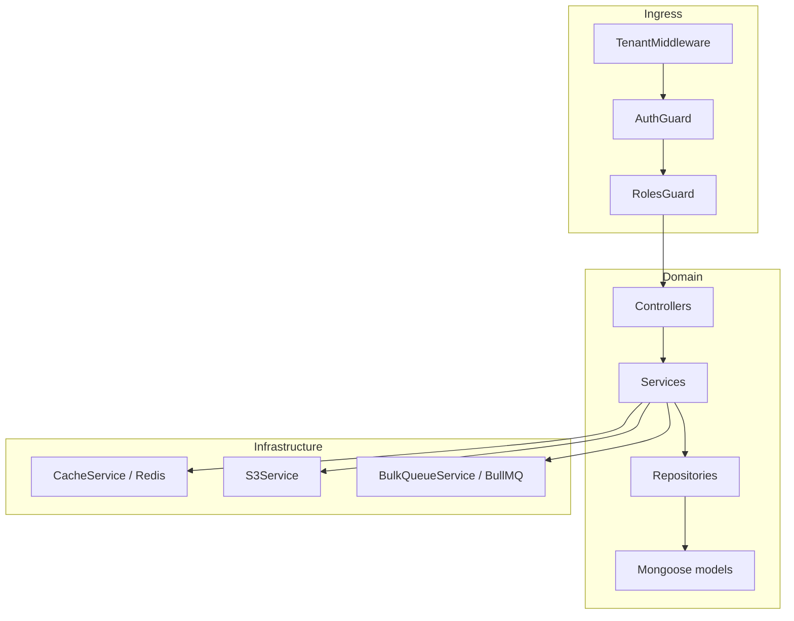
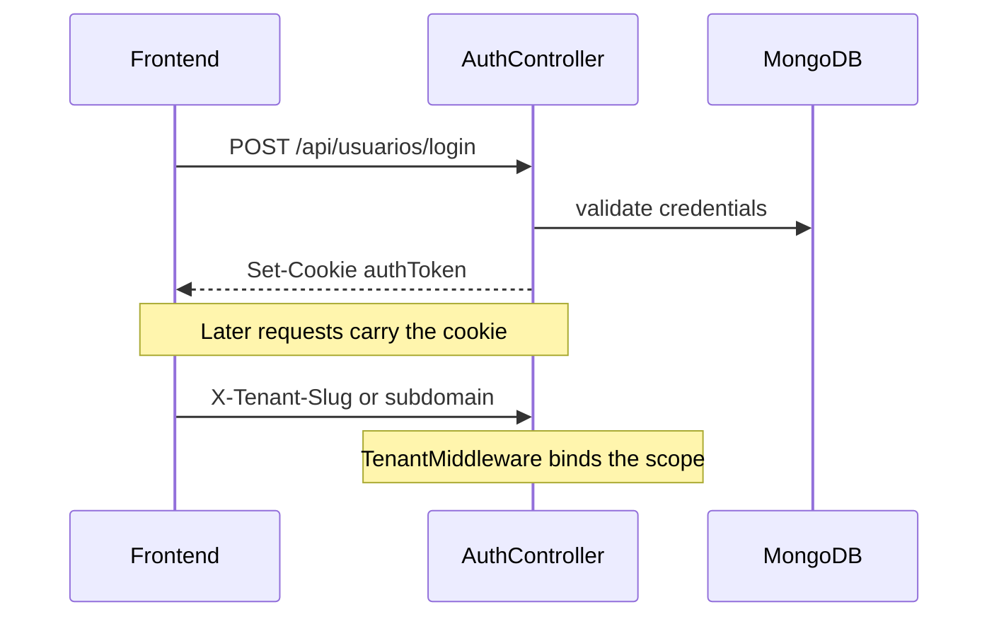

# Architecture — api-maranguape

**[Português](ARCHITECTURE.md)** | **[English](ARCHITECTURE.en.md)**

Technical overview of the multi-tenant NestJS API: layers, modules, isolation, and worker.

## Overview



HTTP pipeline:

1. **TenantMiddleware** resolves `tenantId` (JWT → `X-Tenant-Slug` → subdomain)
2. **AuthGuard** / **RolesGuard** authenticate and authorize
3. **Controller** validates input (DTOs + global `ValidationPipe`)
4. **Service** applies business rules
5. **Repository** hits MongoDB scoped by tenant
6. Side effects: Redis cache, S3, BullMQ queue

Domain errors use `AppError` + global `HttpExceptionFilter`.

## Code layout

```
src/
  main.ts                 # Express/Nest bootstrap, pipes, CORS, rate limit
  app.module.ts           # module wiring
  worker.ts               # standalone bulk worker process
  common/                 # guards, decorators, filters, middleware, roles
  config/                 # env, CORS, branding policy
  database/               # Mongoose root + IndexSyncService
  infrastructure/
    redis/ cache/ s3/ queue/
  modules/
    auth/ tenants/ funcionarios/ setores/
    referencias/ cargos-comissionados/
    search/ dashboard/ audit/ health/
  scripts/                # migrations and seeds
```

`legacy-bridge.ts` is a no-op when `NEST_MIGRATED=all` (default): the Express → Nest migration is complete.

## Domain modules

| Module | Responsibility |
|--------|----------------|
| `auth` | Login/logout/verify; JWT cookie; user CRUD under `/manage` |
| `tenants` | Multi-tenant CRUD, branding, assets, public slug lookup |
| `funcionarios` | CRUD, lotação, S3 media, bulk delete/CSV, quotas |
| `setores` | Setor/Subsetor hierarchy (tree, rename, reparent) |
| `referencias` | Catalog + tree (`parentId`), chains, delete impact |
| `cargos-comissionados` | Commissioned titles + Excel import |
| `search` | Autocomplete and text search |
| `dashboard` | Aggregations (summary, contracts, payroll) |
| `audit` | Paginated action log |
| `health` | `/`, `/health`, `/metrics` |

## Auth and roles

- Cookie **`authToken`** (httpOnly; production uses `secure` + `sameSite=none`)
- JWT payload: `{ id, role, username, tenantId }`
- Invalidation via `User.lastValidToken` / `tokenExpiresAt` + `TokenCleanupService` cron
- Decorators: `@Roles()`, `@CurrentUser()`, `@TenantId()`
- Groups: `TENANT_ELEVATED` (`owner|admin|superadmin`), `TENANT_STAFF` (`owner|admin|user`), `USERS_MANAGERS` (`owner|superadmin`)

## Multi-tenancy

**Model:** shared MongoDB + `tenantId` on documents.

| Layer | Isolation |
|-------|-----------|
| MongoDB | Repository filters by `tenantId` |
| Redis | Prefix `tenant:{id}:…` + cache version bump |
| S3 | Prefix `uploads/{tenantId}/…` |

Fail-closed: non-`superadmin` without `tenantId` → **403**.

`superadmin` may act on a municipality via `X-Act-As-Tenant: slug` or `?actAs=`.

### Login + tenant



## References (tree)

References form a hierarchy via `parentId` (no cycles):

- `GET /api/referencias/arvore` — full tenant tree
- `GET /api/referencias/:id/ancestrais` / `descendentes` — `$graphLookup`
- `GET /api/referencias/funcionario/:id/cadeia` — chain for an employee (`referenciaId`)
- `GET /api/referencias/:id/impacto-exclusao` — impact before delete
- Patch/delete with child reparent when applicable

Tree helpers: `src/modules/referencias/utils/`.

## Queues (BullMQ)

Queue `funcionarios-bulk`:

| Job | Use |
|-----|-----|
| `delete-users` | Bulk delete |
| `export-csv` | CSV export |

Loads ≤ `BULK_SYNC_THRESHOLD` (200) run sync; larger loads enqueue. Status: `GET /api/funcionarios/jobs/:jobId`.

- `BULK_WORKER_EMBEDDED=true` (default): worker inside the API process
- `false`: run `npm run worker:bulk` (`src/worker.ts`)

## Cache

`CacheService` versions keys per tenant (`tenant:{id}:cache:v`). Mutations bump the version instead of deleting keys one by one.

## Observability

- `MetricsMiddleware` + `GET /metrics` (in-process counters)
- `GET /health` — liveness with uptime
- Structured logger under `src/common/logger/`

## Indexes

`IndexSyncService` syncs indexes on boot. Compound uniques include `tenantId` (e.g. `{ tenantId, nome }` on employees). See [RUNBOOK.en.md](RUNBOOK.en.md) for dropping legacy global uniques.

## Related

- [API.en.md](API.en.md) — routes
- [RUNBOOK.en.md](RUNBOOK.en.md) — ops and env
- [README.en.md](../README.en.md) — overview
