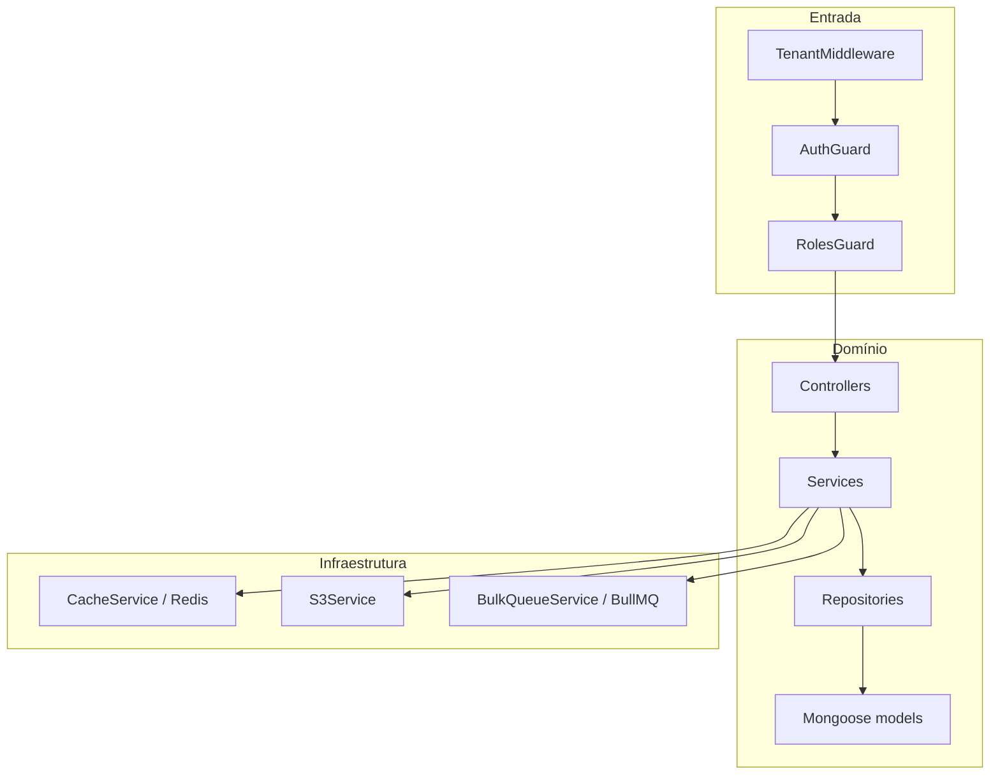
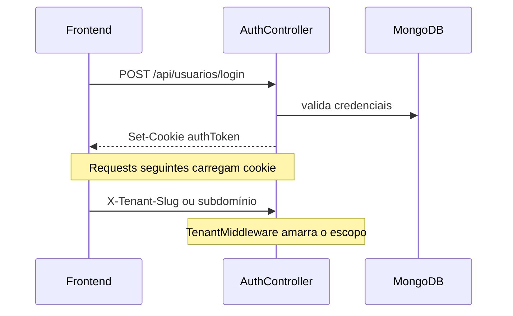

# Arquitetura — api-maranguape

**[Português](ARCHITECTURE.md)** | **[English](ARCHITECTURE.en.md)**

Visão técnica da API NestJS multi-tenant: camadas, módulos, isolamento e worker.

## Visão geral



Pipeline HTTP:

1. **TenantMiddleware** resolve `tenantId` (JWT → `X-Tenant-Slug` → subdomínio)
2. **AuthGuard** / **RolesGuard** autenticam e autorizam
3. **Controller** valida entrada (DTOs + `ValidationPipe` global)
4. **Service** aplica regras de negócio
5. **Repository** acessa MongoDB escopado por tenant
6. Side effects: cache Redis, S3, fila BullMQ

Erros de domínio usam `AppError` + filtro global `HttpExceptionFilter`.

## Layout do código

```
src/
  main.ts                 # bootstrap Express/Nest, pipes, CORS, rate limit
  app.module.ts           # wiring de módulos
  worker.ts               # processo standalone do worker bulk
  common/                 # guards, decorators, filters, middleware, roles
  config/                 # env, CORS, branding policy
  database/               # Mongoose root + IndexSyncService
  infrastructure/
    redis/ cache/ s3/ queue/
  modules/
    auth/ tenants/ funcionarios/ setores/
    referencias/ cargos-comissionados/
    search/ dashboard/ audit/ health/
  scripts/                # migrações e seeds
```

`legacy-bridge.ts` permanece como no-op quando `NEST_MIGRATED=all` (padrão): a migração Express → Nest está concluída.

## Módulos de domínio

| Módulo | Responsabilidade |
|--------|------------------|
| `auth` | Login/logout/verify; cookie JWT; CRUD de usuários em `/manage` |
| `tenants` | CRUD multi-tenant, branding, assets, lookup público por slug |
| `funcionarios` | CRUD, lotação, mídia S3, bulk delete/CSV, cotas |
| `setores` | Hierarquia Setor/Subsetor (árvore, rename, reparent) |
| `referencias` | Catálogo + árvore (`parentId`), cadeias, impacto de exclusão |
| `cargos-comissionados` | Títulos comissionados + import Excel |
| `search` | Autocomplete e busca textual |
| `dashboard` | Aggregations (summary, contratos, payroll) |
| `audit` | Log paginado de ações |
| `health` | `/`, `/health`, `/metrics` |

## Auth e papéis

- Cookie **`authToken`** (httpOnly; em produção `secure` + `sameSite=none`)
- Payload JWT: `{ id, role, username, tenantId }`
- Invalidação via `User.lastValidToken` / `tokenExpiresAt` + cron `TokenCleanupService`
- Decorators: `@Roles()`, `@CurrentUser()`, `@TenantId()`
- Grupos: `TENANT_ELEVATED` (`owner|admin|superadmin`), `TENANT_STAFF` (`owner|admin|user`), `USERS_MANAGERS` (`owner|superadmin`)

## Multi-tenant

**Modelo:** MongoDB compartilhado + campo `tenantId` em documentos.

| Camada | Isolamento |
|--------|------------|
| MongoDB | Filtros por `tenantId` nos repositórios |
| Redis | Prefixo `tenant:{id}:…` + version bump de cache |
| S3 | Prefixo `uploads/{tenantId}/…` |

Fail-closed: usuário que não é `superadmin` e não tem `tenantId` → **403**.

`superadmin` pode atuar em um município via `X-Act-As-Tenant: slug` ou `?actAs=`.

### Login + tenant



## Referências (árvore)

Referências formam um grafo hierárquico por `parentId` (sem ciclos):

- `GET /api/referencias/arvore` — árvore completa do tenant
- `GET /api/referencias/:id/ancestrais` / `descendentes` — `$graphLookup`
- `GET /api/referencias/funcionario/:id/cadeia` — cadeia ligada ao funcionário (`referenciaId`)
- `GET /api/referencias/:id/impacto-exclusao` — impacto antes de deletar
- Patch/delete com reparent de filhos quando aplicável

Utilitários de árvore: `src/modules/referencias/utils/`.

## Filas (BullMQ)

Fila `funcionarios-bulk`:

| Job | Uso |
|-----|-----|
| `delete-users` | Exclusão em massa |
| `export-csv` | Exportação CSV |

Se a carga ≤ `BULK_SYNC_THRESHOLD` (200), executa síncrono; acima disso enfileira. Status: `GET /api/funcionarios/jobs/:jobId`.

- `BULK_WORKER_EMBEDDED=true` (padrão): worker dentro do processo da API
- `false`: rode `npm run worker:bulk` (`src/worker.ts`)

## Cache

`CacheService` versiona chaves por tenant (`tenant:{id}:cache:v`). Mutações fazem bump de versão em vez de invalidar chave a chave.

## Observabilidade

- `MetricsMiddleware` + `GET /metrics` (contadores in-process)
- `GET /health` — liveness com uptime
- Logger estruturado em `src/common/logger/`

## Índices

`IndexSyncService` sincroniza índices no boot. Uniques compostos incluem `tenantId` (ex.: `{ tenantId, nome }` em funcionários). Ver [RUNBOOK.md](RUNBOOK.md) para drop de índices legados globais.

## Relacionado

- [API.md](API.md) — rotas
- [RUNBOOK.md](RUNBOOK.md) — ops e env
- [README.md](../README.md) — visão geral
